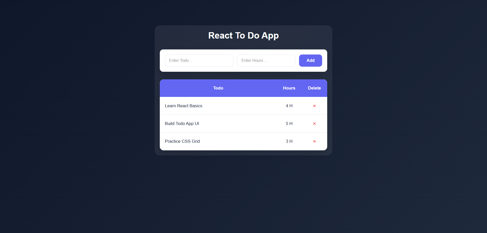
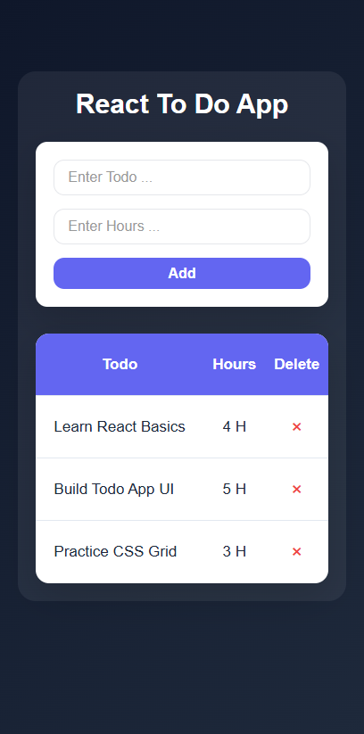

# React Todo App

A simple and responsive Todo application built with React. Users can add tasks, specify estimated hours, and remove tasks from the list.

## 🚀 Live Demo

🔗 **Demo**: [https://alx-react-to-do-app.vercel.app/](https://alx-react-to-do-app.vercel.app/) 

---

## ✨ Features

- Add new tasks
- Delete tasks
- Track estimated hours
- Mark tasks as completed / not completed
- Responsive design
- Unique task IDs generated using `crypto.randomUUID()`.

---

## 📸 Screenshots

### Desktop View



### Mobile View



---

## 🧱 Project Structure

```text
src/
│
├── components/
│       ├── AddItems.css
│       ├── AddItems.js
│       ├── TodoItems.css
│       └── TodoItems.js
│
├── App.css
├── App.js
├── index.css
└── index.js
```

---

## 🛠️ Technologies Used

* React
* JavaScript (ES6+)
* CSS3

---

## ⚙️ Installation

Clone the repository:

```bash
git clone https://github.com/alexander-sands/react-todo-app.git
```

Move to the project directory:

```bash
cd react-todo-app
```

Install dependencies:

```bash
npm install
```

Run the development server:

```bash
npm start
```

Open:

```text
http://localhost:3000
```

---

## 🧠 How It Works

### Add Task

1. Enter the task name.
2. Enter the estimated hours.
3. Submit the form.
4. The task is added to the list.

### Delete Task

Click the delete button beside any task to remove it instantly.

### Task Completion

Each task has a completion status:

- Click on a task or button to mark it as completed
- Completed tasks are visually highlighted
- Tasks can be toggled between done and not done

---

## 🚀 Future Improvements

* Edit existing tasks.
* Save tasks using Local Storage.
* Mark tasks as completed.
* Filter tasks by status.
* Search functionality.
* Dark Mode support.

---

## 👤 Author

Developed by AbdelRahman Khalaf as part of a continuous journey in modern front-end development and React application architecture.
